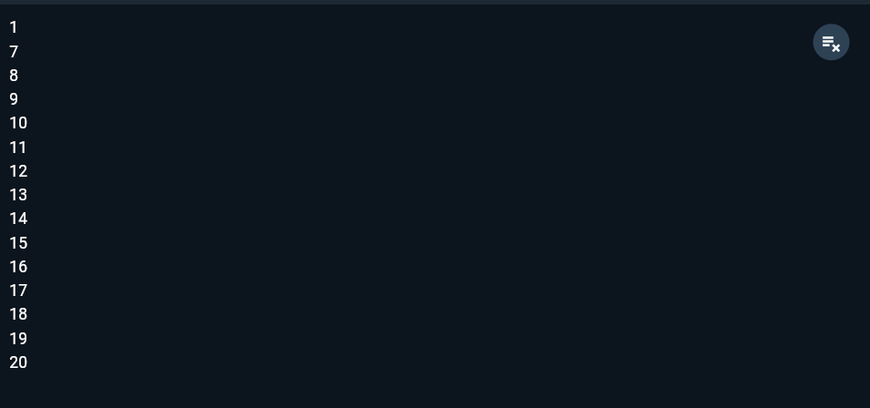

#### Nama : Nadila Amalia Pribadi
#### Kelas: TI-3F / 19
#### NIM  : 2241720114

---

## Laporan Jobsheet 3 Pemrograman Mobile

## Praktikum 1
### - Langkah 1
```dart
void main() {
  String test = "test2";
  if (test == "test1") {
     print("Test1");
  } else if (test == "test2") {
     print("Test2");
  } else {
     print("Something else");
  }

  if (test == "test2") print("Test2 again");
}
```

### - Langkah 2

- Program akan memunculkan hasil "Test2" dan "Test2 again". Variabel test bertipe data String berisi nilai "test2" yang kemudian akan dimasukkan ke dalam if-else untuk dicek apakah sesuai dengan "test2". Sedangkan yang bawah adalah ternary operator jika variabel test berisi "test2" maka akan menampilkan "Test2 again"

### - Langkah 3
```dart
void main() {
  bool test = true;
  if (test) {
     print("Kebenaran");
  }
}
```
- Output:

Program akan memunculkan hasil "Kebenaran" karena mengecek apakah variabel test bernilai true, jika benar maka akan menampilkan "Kebenaran"

## Praktikum 2
### - Langkah 1
```dart
void main() {
  int counter = 20;
  while (counter < 33) {
    print(counter);
    counter++;
  }
}
```

### - Langkah 2

- Program akan melakukan looping sebanyak 13 kali, karena nilai awal counter adalah 20 dan akan terus dilooping sampai nilai counter < 33

### - Langkah 3
```dart
void main() {
  int counter = 60;
  do {
    print(counter);
    counter++;
  } while (counter < 77);
}
```
- Output:

Program akan melakukan looping sebanyak 17 kali, karena nilai awal counter adalah 60 dan akan terus dilooping sampai nilai counter < 77

## Praktikum 3
### - Langkah 1
```dart
void main() {
  for (int index = 10; index < 27; index++) {
    print(index);
  }
}
```

### - Langkah 2

- Program akan melakukan looping dan menampilkan index dari 10 sampai dengan 26

### - Langkah 3
```dart
void main() {
  for(int index=1;index<=30;index++){
     if (index == 21) {
       break;
     }
     else if (index > 1 && index < 7) {
       continue;
     }
     print(index);
  }
}
```

- Program akan melakukan looping mulai dari 1 sampai dengan 30. Namun saat variabel index bernilai 21 maka looping akan dihentikan(break) dan pada saat index bernilai lebih dari 1 dan kurang dari 7, maka iterasi itu akan dilewati(continue) dan nilai index pada iterasi itu tidak tampil.

## Tugas Praktikum
```dart
void main() {
  for (int index = 0; index <= 201; index++) {
    bool prima = true;
    if (index < 2) {
      prima = false;
    } else {
      for (int i = 2; i <= index ~/ 2; i++) {
        if (index % i == 0) {
          prima = false;
          break;
        }
      }
    }
    if (prima) {
      print('Bilangan Prima $index - Nadila Amalia Pribadi 2241720114');
    }
  }
}
```


