#### Nama : Nadila Amalia Pribadi
#### Kelas: TI-3F / 19
#### NIM  : 2241720114

---

## Laporan Jobsheet 4 Pemrograman Mobile

## Praktikum 1
### - Langkah 1
```dart
void main(){
  var list = [1, 2, 3];
  assert(list.length == 3);
  assert(list[1] == 2);
  print(list.length);
  print(list[1]);

  list[1] = 1;
  assert(list[1] == 1);
  print(list[1]);
}
```
### - Langkah 2
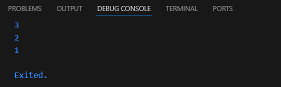
- Kode di atas mendefinisikan sebuah list (array) dengan elemen [1, 2, 3], kemudian melakukan beberapa operasi untuk memverifikasi dan memodifikasi isinya. Awalnya, kode memeriksa panjang list dengan assert(list.length == 3) untuk memastikan bahwa list memiliki tiga elemen dan juga memeriksa nilai elemen kedua dengan assert(list[1] == 2). Setelah itu, panjang list dan elemen kedua (yang bernilai 2) dicetak. Kemudian, elemen kedua diubah menjadi 1 (list[1] = 1), diikuti oleh verifikasi dengan assert(list[1] == 1) untuk memastikan perubahan berhasil, dan mencetak nilai elemen yang telah diubah.

### - Langkah 3
```dart
void main(){
  final List<String?> list = List.filled(5, null);

  list[1] = 'Nadila Amalia Pribadi';  
  list[2] = '2241720114';  
  assert(list.length == 3);
  assert(list[1] == 2);
  print(list.length);
  print(list[1]);

  list[1] = '1';
  assert(list[1] == 1);
  print(list[1]);
}
```
- Output:
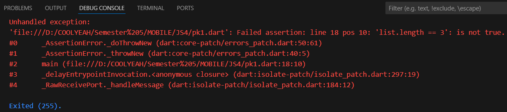
Jika tidak memenuhi syarat pada assert maka program akan otomatis terhenti dan akan menampilkan error atau exception

- Jika mengubahnya seperti ini, maka akan berjalan tanpa error
```dart
void main(){
  final List<String?> list = List.filled(5, null);

  list[1] = 'Nadila Amalia Pribadi';  
  list[2] = '2241720114';  

  print(list.length);
  assert(list.length == 5);
  print(list[1]);
  print(list[2]);
}
```
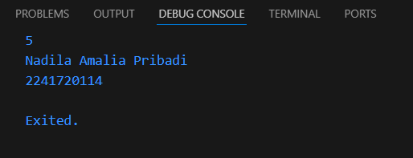


## Praktikum 2
### - Langkah 1
```dart
void main(){
  var halogens = {'fluorine', 'chlorine', 'bromine', 'iodine', 'astatine'};
  print(halogens);
}
```
### - Langkah 2
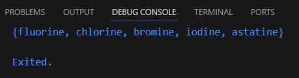
- Program akan mencetak isi dari halogens yaitu 'fluorine', 'chlorine', 'bromine', 'iodine', 'astatine'

### - Langkah 3
```dart
var names1 = <String>{};
Set<String> names2 = {}; // This works, too.
var names3 = {}; // Creates a map, not a set.

print(names1);
print(names2);
print(names3);
```
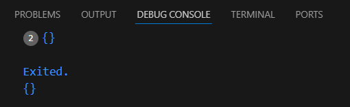
- Program tidak akan menampilkan apa-apa karena variabel names1, names2, dan names3 masih kosong dan tidak ada isinya

- Menambahkan NIM dan Nama
```dart
void main(){
  var names1 = <String>{};
  Set<String> names2 = {}; // This works, too.
  var names3 = {}; // Creates a map, not a set.

   // Menambahkan elemen ke names1 menggunakan .add()
  names1.add('Nadila Amalia Pribadi');
  names1.add('2241720114');

  // Menambahkan elemen ke names2 menggunakan .addAll()
  names2.addAll(['Nadila Amalia Pribadi', '2241720114']);  


  print(names1);
  print(names2);
  print(names3);
}
```
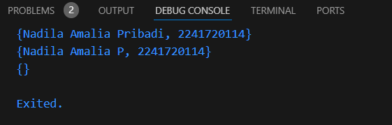
- Elemen ditambahkan ke names1 menggunakan metode .add(), yang menambahkan satu elemen ke set, sedangkan names2 menggunakan metode .addAll(), yang menambahkan beberapa elemen sekaligus ke set. Akhirnya, program mencetak isi dari names1, names2, dan names3


## Praktikum 3
### - Langkah 1
```dart
void main(){
  var gifts = {
    // Key:    Value
    'first': 'partridge',
    'second': 'turtledoves',
    'fifth': 1
  };

  var nobleGases = {
    2: 'helium',
    10: 'neon',
    18: 2,
  };

  print(gifts);
  print(nobleGases);
}
```

### - Langkah 2
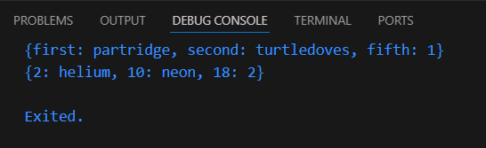
- Pada gifts, Key berupa string ('first', 'second', 'fifth') dan Value berupa string atau integer, sedangkan pada nobleGases, Key berupa angka (2, 10, 18) dengan Value berupa string atau integer. Program kemudian mencetak isi kedua maps tersebut.

### - Langkah 3
```dart
void main(){
  var gifts = {
    // Key:    Value
    'first': 'partridge',
    'second': 'turtledoves',
    'fifth': 1
  };

  var nobleGases = {
    2: 'helium',
    10: 'neon',
    18: 2,
  };

  var mhs1 = Map<String, String>();
  gifts['first'] = 'partridge';
  gifts['second'] = 'turtledoves';
  gifts['fifth'] = 'golden rings';

  var mhs2 = Map<int, String>();
  nobleGases[2] = 'helium';
  nobleGases[10] = 'neon';
  nobleGases[18] = 'argon';

  print(gifts);
  print(nobleGases);
}
```
- Ouput:
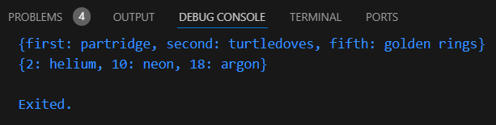

- nilai pada Maps gifts diubah dengan menetapkan Key 'first', 'second', dan 'fifth' ke nilai baru berupa string. Selanjutnya, nilai pada Maps nobleGases diubah dengan menetapkan Key 2, 10, dan 18 ke nilai baru berupa string.

- Namun akan muncul peringatan bahwa variabel mhs1 dan mhs2 tida digunakan
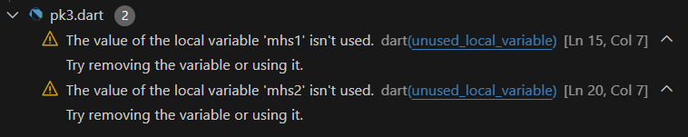

- Menambahkan Nama dan NIM
```dart
void main(){
  var gifts = {
    // Key:    Value
    'first': 'partridge',
    'second': 'turtledoves',
    'fifth': 1
  };

  var nobleGases = {
    2: 'helium',
    10: 'neon',
    18: 2,
  };

  var mhs1 = Map<String, String>();
  mhs1['Nama'] = 'Nadila Amalia Pribadi';
  mhs1['NIM'] = '2241720114';

  gifts['first'] = 'partridge';
  gifts['second'] = 'turtledoves';
  gifts['fifth'] = 'golden rings';

  var mhs2 = Map<int, String>();
  mhs2[1] = 'Nadila Amalia Pribadi';
  mhs2[2] = '2241720114';

  nobleGases[2] = 'helium';
  nobleGases[10] = 'neon';
  nobleGases[18] = 'argon';

  print(mhs1);
  print(mhs2);
}
```
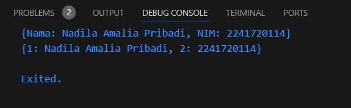


## Praktikum 4
### - Langkah 1
```dart
void main(){
  var list = [1, 2, 3];
  var list2 = [0, ...list];
  print(list);
  print(list2);
  print(list2.length);
}
```

### - Langkah 2
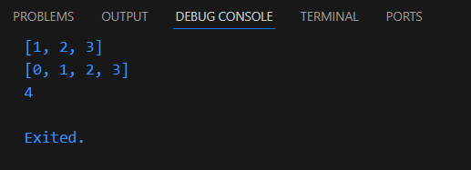
- Kode tersebut mendefinisikan dua daftar (list), list dan list2. list berisi tiga elemen [1, 2, 3], sedangkan list2 dibuat dengan menambahkan elemen 0 di depan dan menggunakan operator ... untuk menyalin seluruh elemen dari list ke list2. Program kemudian mencetak isi dari list, list2, dan panjang dari list2, yang berjumlah 4 elemen.

### - Langkah 3
```dart
void main(){
  var list = [1, 2, 3];
  var list2 = [0, ...list];
  print(list);
  print(list2);
  print(list2.length);

  var list1 = [1, 2, null];
  print(list1);
  var list3 = [0, ...?list1];
  print(list3.length);
}
```
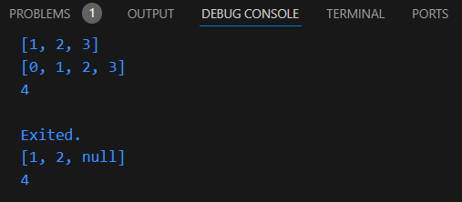
- Kode tersebut mendefinisikan beberapa daftar (list). list berisi [1, 2, 3], dan list2 adalah daftar baru yang menambahkan 0 di depan elemen-elemen list menggunakan operator ..., lalu mencetak kedua daftar dan panjang list2 (4). list1 berisi [1, 2, null], yang memungkinkan nilai null. Pada list3, operator ...? digunakan untuk menambahkan elemen dari list1 ke list3 hanya jika list1 tidak bernilai null. Akhirnya, panjang list3 (4 elemen) dicetak.

- Menambahkan NIM dan Nama dengan Spread Operator
```dart
  var nim = [2241720114];
  var data = ['Nadila Amalia Pribadi', ...?nim];
  print(data);
```
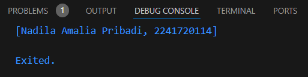

### - Langkah 4
```dart
  var nav = ['Home', 'Furniture', 'Plants', if (promoActive) 'Outlet'];
  print(nav);
```
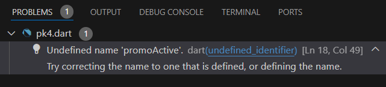

- promoActive = true
```dart
  var promoActive = true;
  var nav = ['Home', 'Furniture', 'Plants', if (promoActive) 'Outlet'];
  print(nav);
```
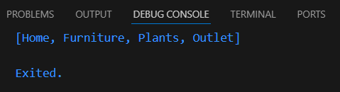

- promoActive = false
```dart
  var promoActive = false;
  var nav = ['Home', 'Furniture', 'Plants', if (promoActive) 'Outlet'];
  print(nav);
```
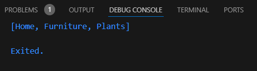

- Kode tersebut mendefinisikan daftar nav yang berisi elemen-elemen string ['Home', 'Furniture', 'Plants']. Daftar ini juga menggunakan ekspresi kondisional if untuk menambahkan elemen 'Outlet' hanya jika variabel boolean promoActive bernilai true. Jika promoActive bernilai false, 'Outlet' tidak akan ditambahkan.

### - Langkah 5
```dart
  var nav2 = ['Home', 'Furniture', 'Plants', if (login case 'Manager') 'Inventory'];
  print(nav2);
```
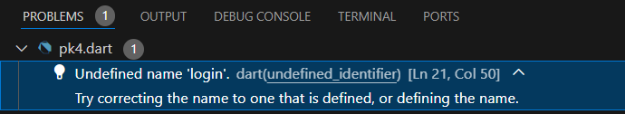

- Login = Manager
```dart
  var login = 'Manager';
  var nav2 = ['Home', 'Furniture', 'Plants', if (login case 'Manager') 'Inventory'];
  print(nav2);
```
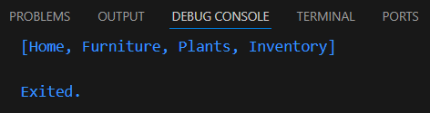

- Login != Manager
```dart
  var login = 'SPV';
  var nav2 = ['Home', 'Furniture', 'Plants', if (login case 'Manager') 'Inventory'];
  print(nav2);
```
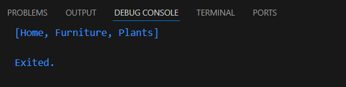
- Kode tersebut mendefinisikan daftar nav2 yang berisi elemen-elemen string ['Home', 'Furniture', 'Plants'] dan menggunakan ekspresi kondisional if untuk menambahkan elemen 'Inventory' jika kondisi login case 'Manager' terpenuhi.

### - Langkah 6
```dart
  var listOfInts = [1, 2, 3];
  var listOfStrings = ['#0', for (var i in listOfInts) '#$i'];
  assert(listOfStrings[1] == '#1');
  print(listOfStrings);
```
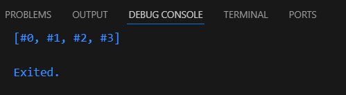
- Kode tersebut mendefinisikan daftar listOfInts yang berisi angka [1, 2, 3]. Selanjutnya, listOfStrings diciptakan dengan menggunakan ekspresi for untuk mengonversi setiap elemen dari listOfInts menjadi string dengan format '#n', di mana n adalah elemen dari listOfInts. Jadi, listOfStrings akan berisi ['#0', '#1', '#2', '#3']. Pernyataan assert memastikan bahwa elemen kedua (listOfStrings[1]) adalah '#1'. Terakhir, program mencetak isi dari listOfStrings. Collection For adalah fitur dalam Dart yang memungkinkan pengembang untuk membuat koleksi (seperti daftar atau set) secara lebih ringkas dan efisien dengan menggunakan sintaksis yang jelas.


## Praktikum 5
### - Langkah 1
```dart
var record = ('first', a: 2, b: true, 'last');
print(record);
```
### - Langkah 2
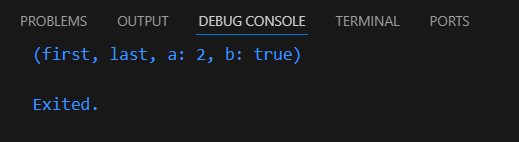
- Kode tersebut mendefinisikan sebuah record yang berisi beberapa elemen: string 'first', nilai named parameter a dengan nilai 2, nilai named parameter b dengan nilai true, dan string 'last'. Tuple ini menggabungkan elemen-elemen yang berbeda tipe dalam satu variabel. Program kemudian mencetak isi dari record, yang menunjukkan struktur dan nilai-nilai yang terdapat di dalamnya.

### - Langkah 3
```dart
void main(){
  var record = ('first', a: 2, b: true, 'last');
  print(record);
  
  var intRecord = (1, 2);
  var swapped = tukar(intRecord);
  print(swapped);
}

(int, int) tukar((int, int) record) {
  var (a, b) = record;
  return (b, a);
}
```
- Output
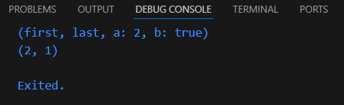
- Kode tersebut mendefinisikan fungsi main() yang berisi beberapa elemen. Pertama, sebuah tuple bernama record dibuat dengan elemen 'first', nilai named parameter a dengan 2, nilai named parameter b dengan true, dan 'last', yang kemudian dicetak. Selanjutnya, intRecord adalah tuple lain berisi dua integer (1, 2). Fungsi tukar() dipanggil dengan intRecord sebagai argumen, yang membalikkan posisi kedua nilai di dalam tuple. Di dalam fungsi tukar(), nilai dari tuple diambil dan ditukar, lalu dikembalikan sebagai tuple baru. Program kemudian mencetak hasil dari swapped, yang berisi tuple dengan nilai (2, 1).

### - Langkah 4
```dart
// Record type annotation in a variable declaration:
(String, int) mahasiswa = ('Nadila Amalia Pribadi', 2241720114);
print(mahasiswa);
```
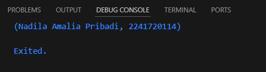
- Kode tersebut mendefinisikan variabel mahasiswa dengan anotasi tipe record yang berisi dua elemen: sebuah string 'Nadila Amalia Pribadi' dan sebuah integer 2241720114. Anotasi tipe (String, int) menunjukkan bahwa variabel mahasiswa akan menyimpan nilai yang terdiri dari tipe string dan integer. Setelah itu, program mencetak isi dari variabel mahasiswa, yang akan menampilkan record tersebut di konsol.

### - Langkah 5
```dart
  var mahasiswa2 = ('first', a: 2, b: true, 'last');

  print(mahasiswa2.$1); // Prints 'first'
  print(mahasiswa2.a); // Prints 2
  print(mahasiswa2.b); // Prints true
  print(mahasiswa2.$2); // Prints 'last'
```
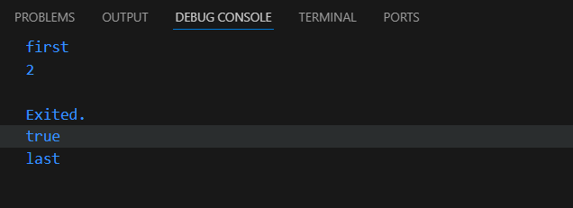

- Program akan mencetak isi dari record mahasiswa2 dengan 2 cara yaitu mengakses nilai dari indexnya dan named parameternya. Contoh $1 berarti mengakses data pada index 1. Namun data yang memiliki named parameter tidak akan dianggapa sebagai index, maka akan dilewati dan bisa diakses dengan memanggil named parameternya.

## Tugas Praktikum
2. Jelaskan yang dimaksud Functions dalam bahasa Dart!
- Functions adalah blok kode yang dapat digunakan untuk menjalankan tugas tertentu. Mereka memungkinkan pengembang untuk mengelompokkan kode yang dapat dipanggil berulang kali, meningkatkan modularitas, dan mengurangi duplikasi kode. Di Dart, fungsi dapat dideklarasikan dengan menggunakan kata kunci void untuk fungsi yang tidak mengembalikan nilai, atau dengan menyebutkan tipe data dari nilai yang dikembalikan.
  ```dart
  void greet(String name) {
    print('Hello, $name!');
  }
  ```

3. Jelaskan jenis-jenis parameter di Functions beserta contoh sintaksnya!
- Positional Parameters: Parameter yang harus diberikan dalam urutan yang tepat.
  ```dart
  void add(int a, int b) {
    print(a + b);
  }
  ```
- Named Parameters: Parameter yang dapat ditentukan dengan nama, meningkatkan keterbacaan. Parameter ini bisa bersifat opsional.
  ```dart
  void introduce({required String name, int? age}) {
    print('Name: $name, Age: $age');
  }
  ```

- Optional Positional Parameters: Parameter yang dapat diabaikan, ditandai dengan tanda kurung siku.
  ```dart
  void display([String? message]) {
    print(message ?? 'No message');
  }
  ```

4. Jelaskan maksud Functions sebagai first-class objects beserta contoh sintaknya!
- Di Dart, fungsi diperlakukan sebagai first-class objects, artinya fungsi dapat disimpan dalam variabel, dipass sebagai argumen, dan dikembalikan dari fungsi lain. Ini memungkinkan fleksibilitas dalam pemrograman.
  ```dart
  void main() {
    var sayHello = (String name) {
      print('Hello, $name!');
    };
    
    sayHello('Nadila');
  }
  ```

5. Apa itu Anonymous Functions? Jelaskan dan berikan contohnya!
- Anonymous Functions, juga dikenal sebagai lambda atau fungsi tanpa nama, adalah fungsi yang tidak memiliki nama dan biasanya didefinisikan secara langsung dalam konteks lain. Mereka sering digunakan untuk operasi sementara, seperti callback atau fungsi yang hanya digunakan sekali. Anonymous functions memberikan cara yang ringkas untuk mengekspresikan logika yang sederhana tanpa perlu mendefinisikan fungsi secara terpisah.
  ```dart
  void main() {
    var numbers = [1, 2, 3, 4, 5];
    
    // Menggunakan anonymous function untuk menghitung kuadrat setiap elemen
    var squares = numbers.map((number) => number * number);
    
    print(squares.toList()); // Output: [1, 4, 9, 16, 25]
  }
  ```

6. Jelaskan perbedaan Lexical scope dan Lexical closures! Berikan contohnya!
- Lexical Scope: Merujuk pada cara fungsi mengakses variabel dari konteks di mana fungsi tersebut didefinisikan. Variabel yang dideklarasikan dalam fungsi hanya dapat diakses di dalam fungsi tersebut.
  ```dart
  void outerFunction() {
    var outerVar = 'Hello';
    void innerFunction() {
      print(outerVar); // Mengakses outerVar
    }
    innerFunction();
  }
  ```
- Lexical Closures: Merupakan fungsi yang "menangkap" dan menyimpan variabel dari scope di mana mereka didefinisikan, bahkan setelah scope tersebut berakhir. Ini memungkinkan fungsi tersebut untuk mengakses variabel-variabel tersebut.
  ```dart
  Function closureExample() {
    var count = 0;
    return () {
      count++;
      print(count);
    };
  }

  var counter = closureExample();
  counter(); // Output: 1
  counter(); // Output: 2
  ```

7. Jelaskan dengan contoh cara membuat return multiple value di Functions!
- Return Multiple Values di functions adalah kemampuan untuk mengembalikan lebih dari satu nilai dari sebuah fungsi.
  ```dart
  class Result {
    final int sum;
    final int product;

    Result(this.sum, this.product);
  }

  Result calculate(int a, int b) {
    return Result(a + b, a * b);
  }

  void main() {
    var result = calculate(3, 4);
    print('Sum: ${result.sum}, Product: ${result.product}');
  }
  ```
