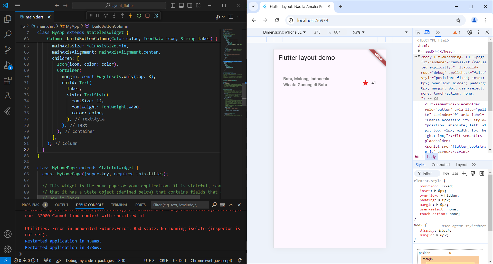
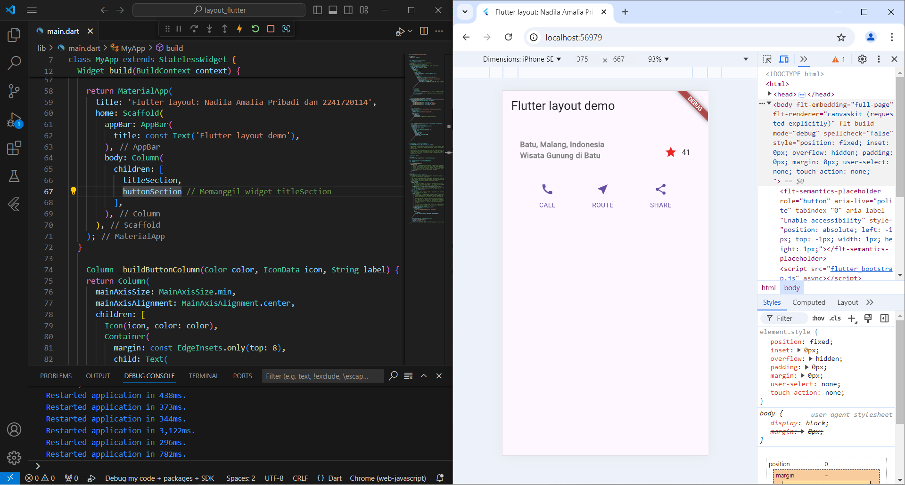
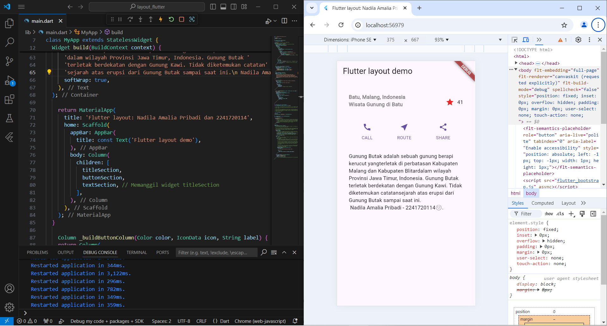
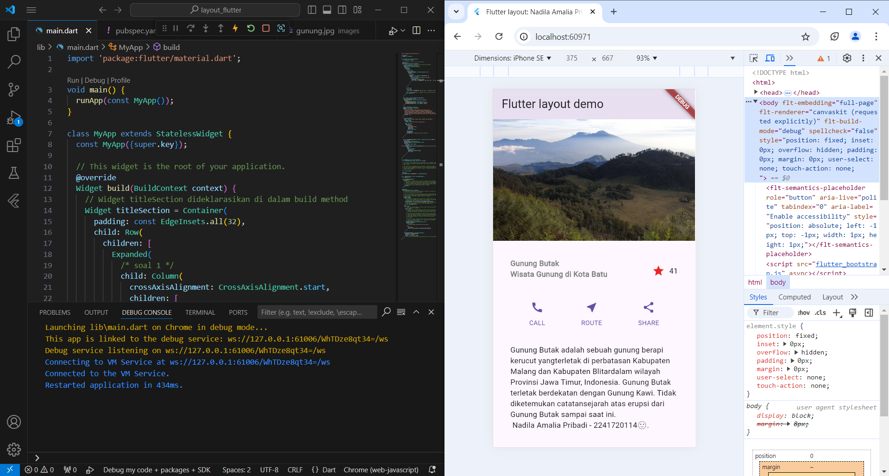
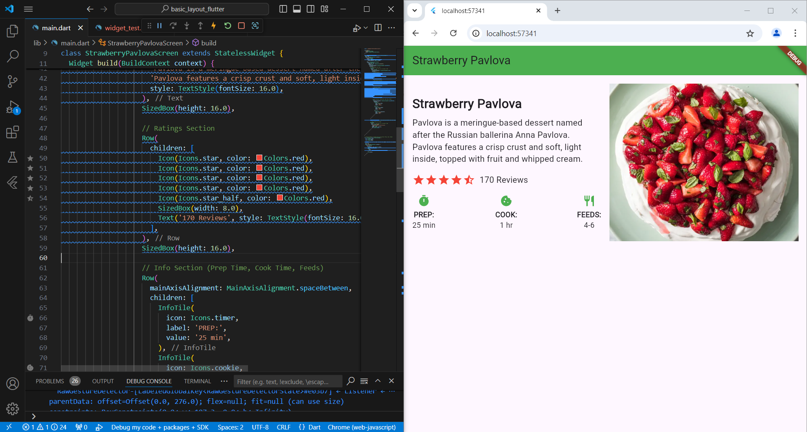
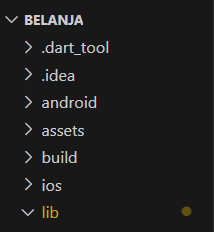
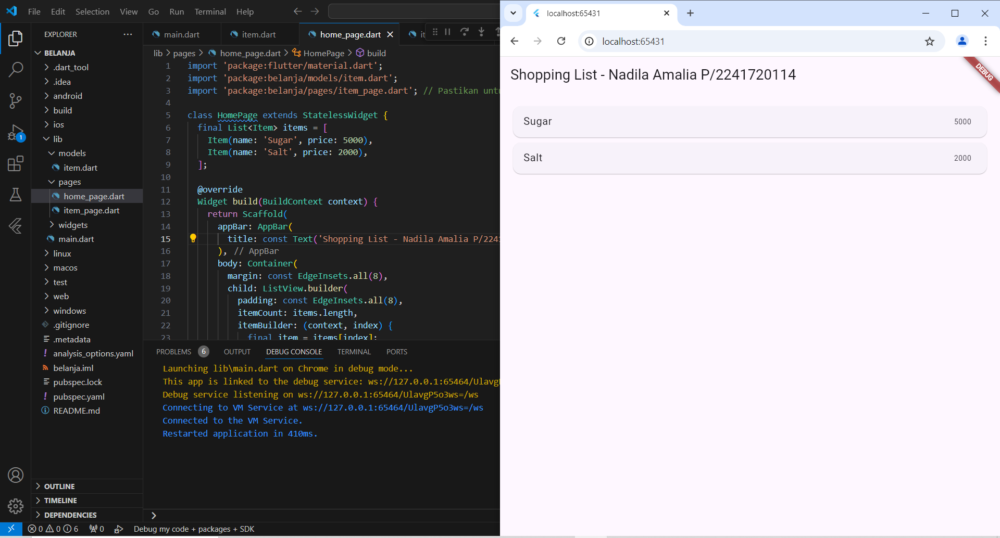
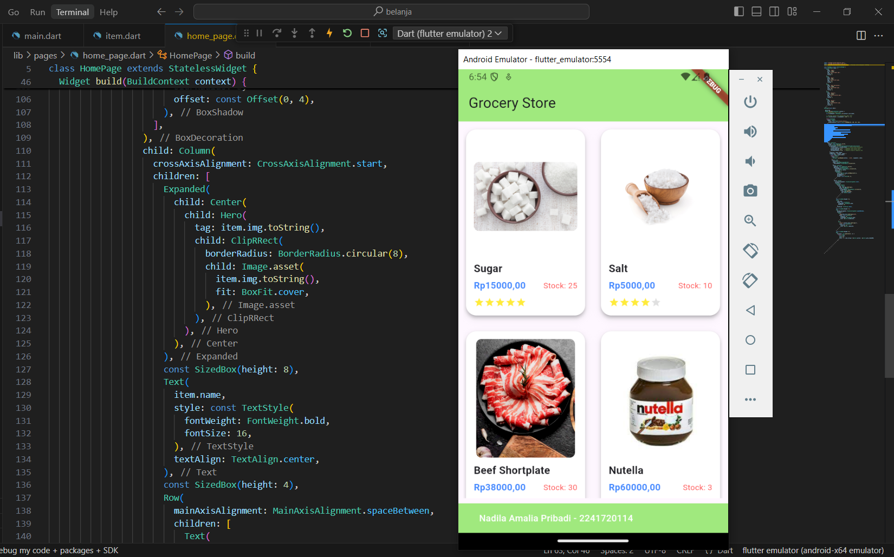
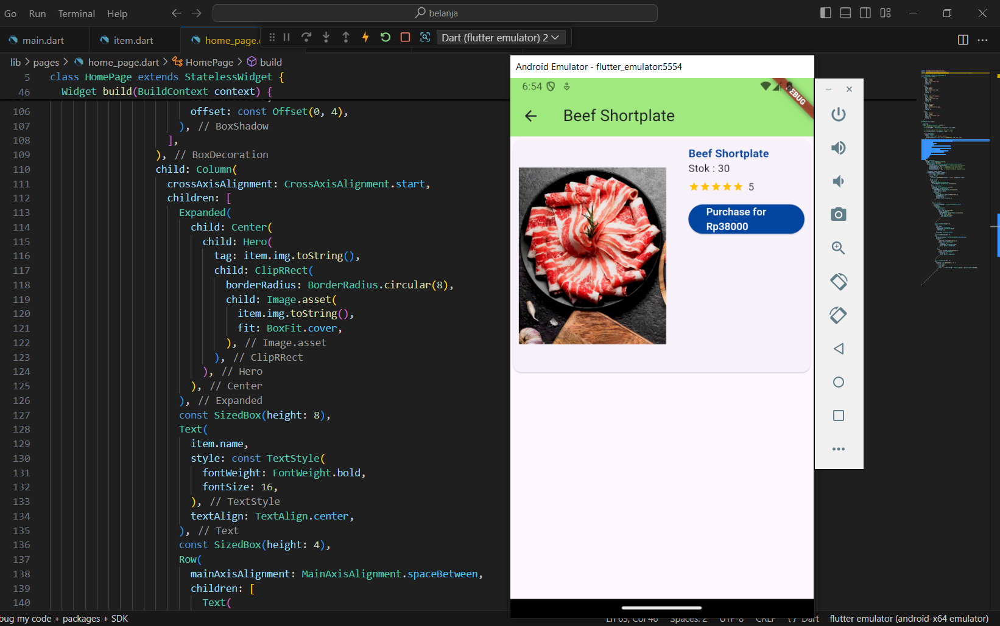

#### Nama : Nadila Amalia Pribadi
#### Kelas: TI-3F / 19
#### NIM  : 2241720114

---

## Laporan Jobsheet 6 Pemrograman Mobile

## Praktikum 1
### - Langkah 2
- main.dart
```dart
import 'package:flutter/material.dart';

void main() {
  runApp(const MyApp());
}

class MyApp extends StatelessWidget {
  const MyApp({super.key});

  // This widget is the root of your application.
  @override
  Widget build(BuildContext context) {
    // Widget titleSection dideklarasikan di dalam build method
    Widget titleSection = Container(
      padding: const EdgeInsets.all(32),
      child: Row(
        children: [
          Expanded(
            /* soal 1 */
            child: Column(
              crossAxisAlignment: CrossAxisAlignment.start,
              children: [
                /* soal 2 */
                Container(
                  padding: const EdgeInsets.only(bottom: 8),
                  child: const Text(
                    'Gunung Butak\nWisata Gunung di Kota Batu',
                    style: TextStyle(
                      fontWeight: FontWeight.bold,
                      color: Color.fromARGB(255, 128, 128, 128), // Menggunakan alpha 255 (opaque)
                    ),
                  ),
                  
                ),
              ],
            ),
          ),
          /* soal 3 */
          const Icon(
            Icons.star,
            color: Color.fromARGB(255, 233, 37, 37), // Menggunakan alpha 255 (opaque)
          ),
          const SizedBox(width: 8), // Menambah jarak antar ikon dan teks
          const Text('41'),
        ],
      ),
    );

    Color color = Theme.of(context).primaryColor;
    Widget buttonSection = Row(
      mainAxisAlignment: MainAxisAlignment.spaceEvenly,
      children: [
        _buildButtonColumn(color, Icons.call, 'CALL'),
        _buildButtonColumn(color, Icons.near_me, 'ROUTE'),
        _buildButtonColumn(color, Icons.share, 'SHARE'),
      ],
    );

    Widget textSection = Container(
    padding: const EdgeInsets.all(32),
    child: const Text(
      'Gunung Butak adalah sebuah gunung berapi kerucut yang' 
      'terletak di perbatasan Kabupaten Malang dan Kabupaten Blitar' 
      'dalam wilayah Provinsi Jawa Timur, Indonesia. Gunung Butak '
      'terletak berdekatan dengan Gunung Kawi. Tidak diketemukan catatan' 
      'sejarah atas erupsi dari Gunung Butak sampai saat ini.\n Nadila Amalia Pribadi - 2241720114🙂.',
      softWrap: true,
    ),
  );

    return MaterialApp(
      title: 'Flutter layout: Nadila Amalia Pribadi dan 2241720114',
      home: Scaffold(
        appBar: AppBar(
          title: const Text('Flutter layout demo'),
        ),
        body: ListView(
          children: [
            Image.asset(
              'images/gunung.jpg',
              width: 600,
              height: 240,
              fit: BoxFit.cover,
            ),
            titleSection,
            buttonSection,
            textSection, // Memanggil widget titleSection
          ],
        ),
      ),
    );
  }

    Column _buildButtonColumn(Color color, IconData icon, String label) {
    return Column(
      mainAxisSize: MainAxisSize.min,
      mainAxisAlignment: MainAxisAlignment.center,
      children: [
        Icon(icon, color: color),
        Container(
          margin: const EdgeInsets.only(top: 8),
          child: Text(
            label,
            style: TextStyle(
              fontSize: 12,
              fontWeight: FontWeight.w400,
              color: color,
            ),
          ),
        ),
      ],
    );
  }
}

class MyHomePage extends StatefulWidget {
  const MyHomePage({super.key, required this.title});

  final String title;

  @override
  State<MyHomePage> createState() => _MyHomePageState();
}

class _MyHomePageState extends State<MyHomePage> {
  int _counter = 0;

  void _incrementCounter() {
    setState(() {
      _counter++;
    });
  }

  @override
  Widget build(BuildContext context) {
    return Scaffold(
      appBar: AppBar(
        backgroundColor: Theme.of(context).colorScheme.inversePrimary,
        title: Text(widget.title),
      ),
      body: Center(
        child: Column(
          mainAxisAlignment: MainAxisAlignment.center,
          children: <Widget>[
            const Text(
              'You have pushed the button this many times:',
            ),
            Text(
              '$_counter',
              style: Theme.of(context).textTheme.headlineMedium,
            ),
          ],
        ),
      ),
      floatingActionButton: FloatingActionButton(
        onPressed: _incrementCounter,
        tooltip: 'Increment',
        child: const Icon(Icons.add),
      ),
    );
  }
}
```
### - Langkah 4


## Praktikum 2
### - Langkah 1 
```dart
    Column _buildButtonColumn(Color color, IconData icon, String label) {
    return Column(
      mainAxisSize: MainAxisSize.min,
      mainAxisAlignment: MainAxisAlignment.center,
      children: [
        Icon(icon, color: color),
        Container(
          margin: const EdgeInsets.only(top: 8),
          child: Text(
            label,
            style: TextStyle(
              fontSize: 12,
              fontWeight: FontWeight.w400,
              color: color,
            ),
          ),
        ),
      ],
    );
  }
```
### - Langkah 2
```dart
    Color color = Theme.of(context).primaryColor;
    Widget buttonSection = Row(
      mainAxisAlignment: MainAxisAlignment.spaceEvenly,
      children: [
        _buildButtonColumn(color, Icons.call, 'CALL'),
        _buildButtonColumn(color, Icons.near_me, 'ROUTE'),
        _buildButtonColumn(color, Icons.share, 'SHARE'),
      ],
    );
```
### - Langkah 3


## Praktikum 3
### - Langkah 1
```dart
    Widget textSection = Container(
    padding: const EdgeInsets.all(32),
    child: const Text(
      'Gunung Butak adalah sebuah gunung berapi kerucut yang' 
      'terletak di perbatasan Kabupaten Malang dan Kabupaten Blitar' 
      'dalam wilayah Provinsi Jawa Timur, Indonesia. Gunung Butak '
      'terletak berdekatan dengan Gunung Kawi. Tidak diketemukan catatan' 
      'sejarah atas erupsi dari Gunung Butak sampai saat ini.\n Nadila Amalia Pribadi - 2241720114🙂.',
      softWrap: true,
    ),
  );
```
### - Langkah 2


## Praktikum 4
### - Langkah 2
```dart
          children: [
            Image.asset(
              'images/gunung.jpg',
              width: 600,
              height: 240,
              fit: BoxFit.cover,
            ),
            titleSection,
            buttonSection,
            textSection, // Memanggil widget titleSection
          ],
```
### - Langkah 3
```dart
        body: ListView(
          children: [
            Image.asset(
              'images/gunung.jpg',
              width: 600,
              height: 240,
              fit: BoxFit.cover,
            ),
            titleSection,
            buttonSection,
            textSection, // Memanggil widget titleSection
          ],
        ),
```


## Tugas Praktikum 1
- Code:
```dart
import 'package:flutter/material.dart';

void main() {
  runApp(MaterialApp(
    home: StrawberryPavlovaScreen(),
  ));
}

class StrawberryPavlovaScreen extends StatelessWidget {
  @override
  Widget build(BuildContext context) {
    return Scaffold(
      appBar: AppBar(
        title: Text('Strawberry Pavlova'),
        backgroundColor: Colors.green,
      ),
      body: SingleChildScrollView(
        child: Padding(
          padding: const EdgeInsets.all(16.0),
          child: Row(
            mainAxisAlignment: MainAxisAlignment.spaceEvenly,
            children: [
              // Left Column with text
              Expanded(
                flex: 1, // Set flex to 1 to make it 50%
                child: Column(
                  crossAxisAlignment: CrossAxisAlignment.start,
                  children: [
                    // Title Section
                    Text(
                      'Strawberry Pavlova',
                      style: TextStyle(
                        fontSize: 24.0,
                        fontWeight: FontWeight.bold,
                      ),
                    ),
                    SizedBox(height: 8.0),

                    // Description Section
                    Text(
                      'Pavlova is a meringue-based dessert named after the Russian ballerina Anna Pavlova. '
                      'Pavlova features a crisp crust and soft, light inside, topped with fruit and whipped cream.',
                      style: TextStyle(fontSize: 16.0),
                    ),
                    SizedBox(height: 16.0),

                    // Ratings Section
                    Row(
                      children: [
                        Icon(Icons.star, color: Colors.red),
                        Icon(Icons.star, color: Colors.red),
                        Icon(Icons.star, color: Colors.red),
                        Icon(Icons.star, color: Colors.red),
                        Icon(Icons.star_half, color: Colors.red),
                        SizedBox(width: 8.0),
                        Text('170 Reviews', style: TextStyle(fontSize: 16.0)),
                      ],
                    ),
                    SizedBox(height: 16.0),

                    // Info Section (Prep Time, Cook Time, Feeds)
                    Row(
                      mainAxisAlignment: MainAxisAlignment.spaceBetween,
                      children: [
                        InfoTile(
                          icon: Icons.timer,
                          label: 'PREP:',
                          value: '25 min',
                        ),
                        InfoTile(
                          icon: Icons.cookie,
                          label: 'COOK:',
                          value: '1 hr',
                        ),
                        InfoTile(
                          icon: Icons.restaurant,
                          label: 'FEEDS:',
                          value: '4-6',
                        ),
                      ],
                    ),
                  ],
                ),
              ),

              SizedBox(width: 16.0), // Add spacing between text and image

              // Right Column with Image
              Expanded(
                flex: 1, // Set flex to 1 to make it 50%
                child: Image.asset(
                  'images/strawberry_pavlova.png',
                  height: 300,
                  width: double.infinity,
                  fit: BoxFit.cover,
                ),
              ),
            ],
          ),
        ),
      ),
    );
  }
}

// InfoTile Widget to display each info section (Prep, Cook, Feeds)
class InfoTile extends StatelessWidget {
  final IconData icon;
  final String label;
  final String value;

  InfoTile({required this.icon, required this.label, required this.value});

  @override
  Widget build(BuildContext context) {
    return Column(
      children: [
        Icon(icon, color: Colors.green),
        SizedBox(height: 4.0),
        Text(
          label,
          style: TextStyle(fontWeight: FontWeight.bold),
        ),
        Text(value),
      ],
    );
  }
}
```
- Output


## Praktikum 5
### - Langkah 1


### - Langkah 2
> home_page.dart
```dart
import 'package:flutter/material.dart';
import 'package:belanja/models/item.dart';

class HomePage extends StatelessWidget {
  @override
  Widget build(BuildContext context) {
    //TODO: implement build
    throw UnimplementedError();
  }
}
```
> item_page.dart
```dart
import 'package:flutter/material.dart';
class ItemPage extends StatelessWidget {
  const ItemPage({super.key});

  @override
  Widget build(BuildContext context) {
    //TODO: implement build
    throw UnimplementedError();
  }
}
```

### - Langkah 3
```dart
import 'package:flutter/material.dart';
import 'package:belanja/pages/home_page.dart';
import 'package:belanja/pages/item_page.dart';

void main() {
  runApp(MaterialApp(
    initialRoute: '/',
    routes: {
      '/': (context) => HomePage(),
      '/item': (context) => const ItemPage(),
    },
  ));
}
```

### - Langkah 4
```dart
class Item {
  String name;
  int price;

  Item({required this.name, required this.price});
}
```

### - Langkah 5
```dart
class HomePage extends StatelessWidget {
  final List<Item> items = [
    Item(name: 'Sugar', price: 5000),
    Item(name: 'Salt', price: 2000),
  ];
}
```
### - Langkah 6
```dart
@override
  Widget build(BuildContext context) {
    return Scaffold(
      appBar: AppBar(
        title: const Text('Home Page'),
      ),
      body: Container(
        margin: const EdgeInsets.all(8),
        child: ListView.builder(
          padding: const EdgeInsets.all(8),
          itemCount: items.length,
          itemBuilder: (context, index) {
            final item = items[index];
            return Card(
              child: Container(
                margin: const EdgeInsets.all(8),
                child: Row(
                  children: [
                    Expanded(child: Text(item.name)),
                    Expanded(
                      child: Text(
                        item.price.toString(),
                        textAlign: TextAlign.end,
                      ),
                    ),
                  ],
                ),
              ),
            );
          },
        ),
      ),
    );
  }
```
### - Langkah 7


## Tugas Praktikum 2
- Code:
> - models -> item.dart
```dart
class Item{
  String name;
  int price;
  String img;
  int stock;
  int rating;

  Item({required this.name, required this.price,
  required this.img, required this.stock,
  required this.rating});
}
```
> - pages -> home_page.dart
```dart
import 'package:flutter/material.dart';
import 'package:belanja/models/item.dart';
import 'package:belanja/pages/item_page.dart'; // Pastikan untuk mengimpor ItemPage

class HomePage extends StatelessWidget {
final List<Item> items = [
    Item(
      name: 'Sugar',
      price: 15000,
      img: 'assets/sugar.jpg',
      stock: 25,
      rating: 5
    ),
    Item(
      name: 'Salt',
      price: 5000,
      img: 'assets/salt.jpg',
      stock: 10,
      rating: 4
    ),
    Item(
      name: 'Beef Shortplate',
      price: 38000,
      img: 'assets/beef.jpg',
      stock: 30,
      rating: 5,
    ),
    Item(
      name: 'Nutella',
      price: 60000,
      img: 'assets/nutella.jpg',
      stock: 3,
      rating: 5,
    ),
    Item(
      name: 'Butter',
      price: 30000,
      img: 'assets/butter.jpg',
      stock: 12,
      rating: 5,
    ),
  ];
HomePage({super.key});

  @override
  Widget build(BuildContext context) {
    // Mendapatkan ukuran layar
    var screenWidth = MediaQuery.of(context).size.width;

    // Tentukan jumlah kolom berdasarkan lebar layar
    int crossAxisCount = screenWidth > 600 ? 3 : 2;

    return Scaffold(
      appBar: AppBar(
        title: const Text('Grocery Store'),
        backgroundColor: const Color.fromARGB(255, 160, 233, 126),
      ),
      bottomNavigationBar: BottomAppBar(
        color: Color.fromARGB(255, 160, 233, 126),
        height: 45,
        child: const Row(
          children: [
            Padding(padding: EdgeInsets.all(8)),
            Text(
            'Nadila Amalia Pribadi - 2241720114',
              style: TextStyle(
                fontWeight: FontWeight.w500,
                color: Colors.white,
              ),
              textAlign: TextAlign.left,
            ),
          ],
        ),
      ),
      body: Container(
        margin: const EdgeInsets.all(8),
        child: GridView.builder(
          gridDelegate: SliverGridDelegateWithFixedCrossAxisCount(
            crossAxisCount: crossAxisCount, // Jumlah kolom disesuaikan
            crossAxisSpacing: 16.0, // Tambahkan jarak antara kolom
            mainAxisSpacing: 16.0,  // Tambahkan jarak antara baris
            childAspectRatio: 0.65,  // Mengatur proporsi tampilan item
          ),
          itemCount: items.length,
          itemBuilder: (context, index) {
            final item = items[index];
            return InkWell(
              onTap: () {
                Navigator.pushNamed(context, '/item', arguments: item);
              },
              child: Card(
                elevation: 4,
                shape: RoundedRectangleBorder(
                  borderRadius: BorderRadius.circular(16),
                ),
                child: Container(
                  padding: const EdgeInsets.all(12),
                  decoration: BoxDecoration(
                    borderRadius: BorderRadius.circular(16),
                    color: Colors.white,
                    boxShadow: [
                      BoxShadow(
                        color: Colors.grey.withOpacity(0.2),
                        spreadRadius: 1,
                        blurRadius: 8,
                        offset: const Offset(0, 4),
                      ),
                    ],
                  ),
                  child: Column(
                    crossAxisAlignment: CrossAxisAlignment.start,
                    children: [
                      Expanded(
                        child: Center(
                          child: Hero(
                            tag: item.img.toString(),
                            child: ClipRRect(
                              borderRadius: BorderRadius.circular(8),
                              child: Image.asset(
                                item.img.toString(),
                                fit: BoxFit.cover,
                              ),
                            ),
                          ),
                        ),
                      ),
                      const SizedBox(height: 8),
                      Text(
                        item.name,
                        style: const TextStyle(
                          fontWeight: FontWeight.bold,
                          fontSize: 16,
                        ),
                        textAlign: TextAlign.center,
                      ),
                      const SizedBox(height: 4),
                      Row(
                        mainAxisAlignment: MainAxisAlignment.spaceBetween,
                        children: [
                          Text(
                            'Rp${item.price.toString()},00',
                            style: const TextStyle(
                              fontSize: 14,
                              fontWeight: FontWeight.bold,
                              color: Colors.blueAccent,
                            ),
                          ),
                          Text(
                            'Stock: ${item.stock.toString()}',
                            style: const TextStyle(
                              fontSize: 12,
                              color: Colors.redAccent,
                            ),
                          ),
                        ],
                      ),
                      const SizedBox(height: 8),
                      Row(
                        children: List.generate(5, (i) {
                          return Icon(
                            Icons.star,
                            size: 16,
                            color: i < item.rating ? Colors.yellow : Colors.grey.shade300,
                          );
                        }),
                      ),
                    ],
                  ),
                ),
              ),
            );
          },
        ),
      ),
    );
  }
}
```
> - pages -> item_page.dart
```dart
import 'package:flutter/material.dart';
import 'package:belanja/models/item.dart';

class ItemPage extends StatelessWidget {
  const ItemPage({super.key});

  @override
  Widget build(BuildContext context) {
    final Item item = ModalRoute.of(context)!.settings.arguments as Item;

    return Scaffold(
      appBar: AppBar(
        title: Text(item.name),
        backgroundColor: const Color.fromARGB(255, 160, 233, 126),
      ),
      body: GestureDetector(
        onTap: () {
          Navigator.pop(context);
        },
        child: SingleChildScrollView(
          // Tambahkan SingleChildScrollView agar bisa di scroll
          child: Card(
            child: Column(
              children: [
                Container(
                  margin: const EdgeInsets.all(8.0),
                  child: Row(
                    crossAxisAlignment: CrossAxisAlignment.start,
                    children: [
                      SizedBox(
                        width: 200,
                        child: Column(
                          children: [
                            Align(
                              alignment: Alignment.centerLeft,
                              child: Hero(
                                tag: item.img.toString(),
                                child: Image.asset(
                                  item.img.toString(),
                                  width: 200,
                                  height: 300,
                                ),
                              ),
                            ),
                          ],
                        ),
                      ),
                      Flexible(
                        child: Container(
                          padding: const EdgeInsets.only(left: 30),
                          child: Column(
                            crossAxisAlignment: CrossAxisAlignment.start,
                            children: [
                              Text(
                                item.name,
                                style: TextStyle(
                                  fontWeight: FontWeight.bold,
                                  fontSize: 15,
                                  color: Colors.blue.shade900,
                                ),
                                textAlign: TextAlign.left,
                              ),
                              Row(
                                children: [
                                  const Text('Stok : '),
                                  Text(item.stock.toString()),
                                ],
                              ),
                              const SizedBox(height: 5),
                              Row(
                                children: [
                                  for (int i = 0; i < 5; i++)
                                    (i < item.rating)
                                        ? const Icon(
                                            Icons.star,
                                            size: 15,
                                            color: Colors.amber,
                                          )
                                        : const Icon(
                                            Icons.star,
                                            size: 15,
                                            color: Colors.black,
                                          ),
                                  const Padding(padding: EdgeInsets.all(3.0)),
                                  Text(item.rating.toString()),
                                ],
                              ),
                              const SizedBox(height: 10),
                              ElevatedButton(
                                onPressed: () {
                                  Navigator.pop(context);
                                },
                                style: ElevatedButton.styleFrom(
                                  backgroundColor:
                                      Colors.blue.shade900, // Warna tombol
                                ),
                                child: Text(
                                  'Purchase for Rp${item.price}',
                                  style: const TextStyle(
                                    color: Colors
                                        .white, // Warna teks menjadi putih
                                  ),
                                ),
                              ),
                            ],
                          ),
                        ),
                      ),
                    ],
                  ),
                ),
              ],
            ),
          ),
        ),
      ),
    );
  }
}
```
> - main.dart
```dart
import 'package:flutter/material.dart';
import 'package:belanja/pages/home_page.dart';
import 'package:belanja/pages/item_page.dart';

void main() {
  //runApp(const MyApp());
  runApp(MaterialApp(
    initialRoute: '/',
    routes: {
      '/': (context) => HomePage(),
      '/item': (context) => const ItemPage(),
    },
  ));
}

class MyApp extends StatelessWidget {
  const MyApp({super.key});

  // This widget is the root of your application.
  @override
  Widget build(BuildContext context) {
    return MaterialApp(
      title: 'Flutter Demo',
      theme: ThemeData(
        colorScheme: ColorScheme.fromSeed(seedColor: Colors.deepPurple),
        useMaterial3: true,
      ),
      home: const MyHomePage(title: 'Flutter Demo Home Page'),
    );
  }
}

class MyHomePage extends StatefulWidget {
  const MyHomePage({super.key, required this.title});

  final String title;

  @override
  State<MyHomePage> createState() => _MyHomePageState();
}

class _MyHomePageState extends State<MyHomePage> {
  int _counter = 0;

  void _incrementCounter() {
    setState(() {
      _counter++;
    });
  }

  @override
  Widget build(BuildContext context) {
    return Scaffold(
      appBar: AppBar(
        backgroundColor: Theme.of(context).colorScheme.inversePrimary,
        title: Text(widget.title),
      ),
      body: Center(
        child: Column(
          mainAxisAlignment: MainAxisAlignment.center,
          children: <Widget>[
            const Text(
              'You have pushed the button this many times:',
            ),
            Text(
              '$_counter',
              style: Theme.of(context).textTheme.headlineMedium,
            ),
          ],
        ),
      ),
      floatingActionButton: FloatingActionButton(
        onPressed: _incrementCounter,
        tooltip: 'Increment',
        child: const Icon(Icons.add),
      ), // This trailing comma makes auto-formatting nicer for build methods.
    );
  }
}
```

- Output

