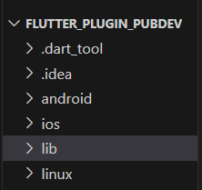
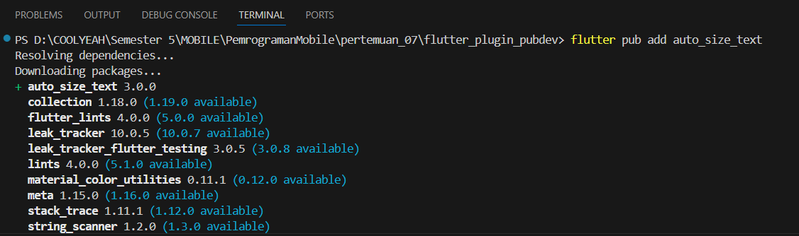
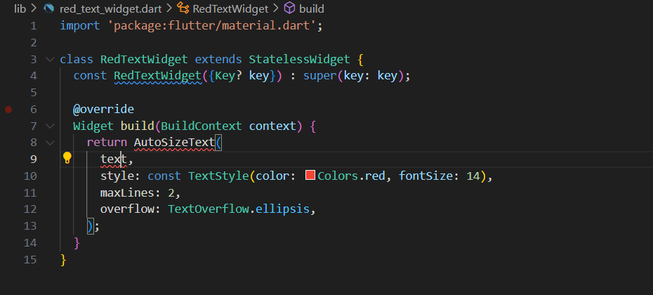
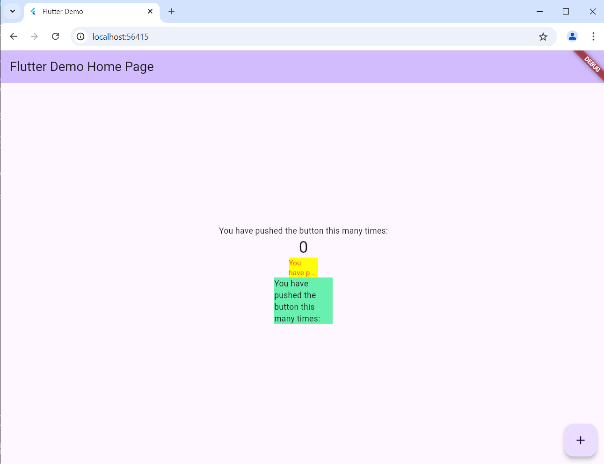

#### Nama : Nadila Amalia Pribadi
#### Kelas: TI-3F / 19
#### NIM  : 2241720114

---

## Laporan Jobsheet 7 Pemrograman Mobile

## Praktikum
### - Langkah 1

### - Langkah 2
> flutter pub add auto_size_text

### - Langkah 3
```dart
import 'package:flutter/material.dart';

class RedTextWidget extends StatelessWidget {
  const RedTextWidget({Key? key}) : super(key: key);

  @override
  Widget build(BuildContext context) {
    return Container();
  }
}
```
### - Langkah 4

- Program error karena plugin belum di import dan belum ada variabel text
### - Langkah 5
```dart
import 'package:flutter/material.dart';
import 'package:auto_size_text/auto_size_text.dart';

class RedTextWidget extends StatelessWidget {
  final String text;

  const RedTextWidget({Key? key, required this.text}) : super(key: key);

  @override
  Widget build(BuildContext context) {
    return AutoSizeText(
      text,
      style: const TextStyle(color: Colors.red, fontSize: 14),
      maxLines: 2,
      overflow: TextOverflow.ellipsis,
    );
  }
}
```
### - Langkah 6
```dart
Container(
   color: Colors.yellowAccent,
   width: 50,
   child: const RedTextWidget(
        text: 'You have pushed the button this many times:',
   ),
),
Container(
    color: Colors.greenAccent,
    width: 100,
    child: const Text(
        'You have pushed the button this many times:',
    ),
),
```


## Tugas Praktikum
2. Jelaskan maksud dari langkah 2 pada praktikum tersebut!
- Langkah 2 adalah langkah untuk menambahkan plugin auto_size_text  ke dalam project
3. Jelaskan maksud dari langkah 5 pada praktikum tersebut!
- kode ini memungkinkan untuk membuat instance dari RedTextWidget sambil mengharuskan untuk memberikan nilai untuk text saat memanggilnya.
4. Pada langkah 6 terdapat dua widget yang ditambahkan, jelaskan fungsi dan perbedaannya!
- Kedua kode di atas adalah dua widget Container yang memiliki warna latar berbeda dan lebar yang berbeda. Container pertama memiliki warna latar kuning (Colors.yellowAccent) dan lebar 50, serta menampung widget RedTextWidget, yang menampilkan teks berwarna merah (dari properti RedTextWidget). Container kedua memiliki warna latar hijau (Colors.greenAccent) dengan lebar 100, dan menampung widget Text standar Flutter yang menampilkan teks biasa tanpa style khusus. Perbedaannya terletak pada lebar masing-masing Container dan jenis widget yang digunakan untuk menampilkan teks—RedTextWidget dengan teks merah vs Text standar tanpa style tambahan.
5. Jelaskan maksud dari tiap parameter yang ada di dalam plugin auto_size_text berdasarkan tautan pada dokumentasi !
- key => Mengontrol bagaimana satu widget menggantikan widget lain di tree.
- textKey => Mengatur kunci untuk widget Teks yang dihasilkan
- style => Jika bukan null, gaya yang akan digunakan untuk teks 
- minFontSize => Batasan ukuran teks minimum yang akan digunakan saat mengubah ukuran teks secara otomatis. Diabaikan jika presetFontSizes ditetapkan.
- maxFontSize => Batasan ukuran teks maksimum yang akan digunakan saat mengubah ukuran teks secara otomatis. Diabaikan jika presetFontSizes ditetapkan.
- stepGranularity => Ukuran langkah di mana ukuran font disesuaikan dengan batasan.
- presetFontSizes => Menentukan terlebih dahulu semua ukuran font yang memungkinkan.
- group => Menyinkronkan ukuran beberapa AutoSizeText
- textAlign => Bagaimana teks harus disejajarkan secara horizontal.
- textDirection => Arah teks. Ini menentukan bagaimana nilai textAlign seperti TextAlign.start dan TextAlign.end diartikan.
- locale => Digunakan untuk memilih font ketika karakter Unicode yang sama dapat ditampilkan secara berbeda, tergantung pada locale.
- softWrap => Apakah teks harus diputus pada jeda baris soft.
- wrapWords => Apakah kata-kata yang tidak muat dalam satu baris harus dibungkus. Nilai default adalah true agar berperilaku seperti Teks.
- overflow => Bagaimana visual yang lebih/melebihi harus ditangani.
- overflowReplacement => Jika teksnya meluap dan tidak sesuai batasnya, widget ini akan ditampilkan sebagai gantinya.
- textScaleFactor => Jumlah piksel font untuk setiap piksel logis. Juga memengaruhi minFontSize, maxFontSize, dan presetFontSizes.
- maxLines => Jumlah baris maksimum opsional untuk teks yang akan direntangkan (span).
- semanticsLabel => Label semantik alternatif untuk teks.

