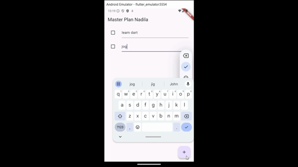
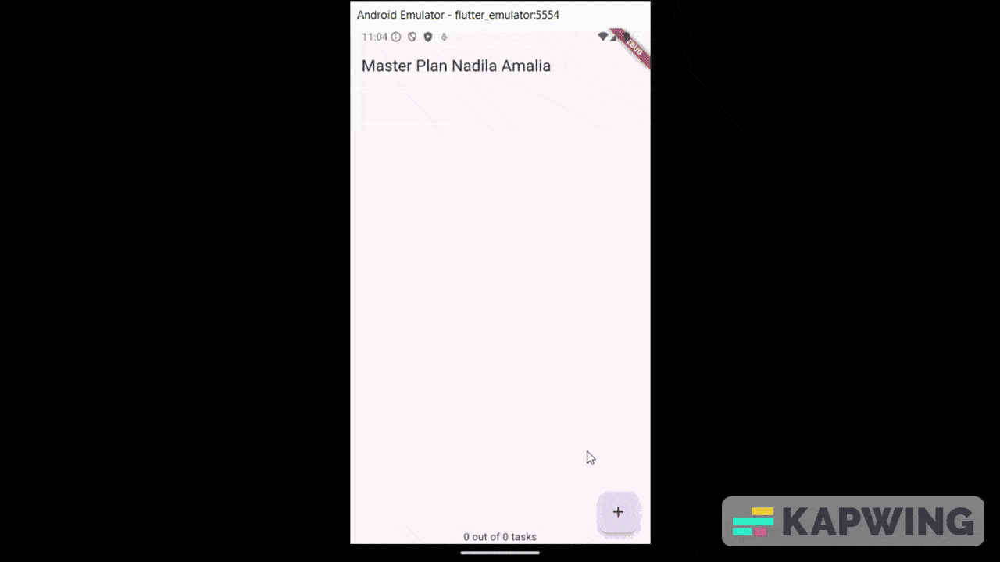
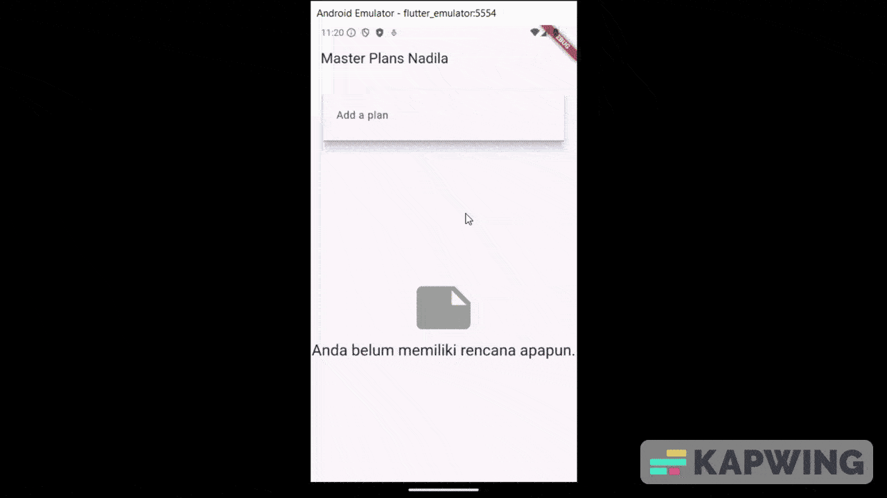

#### Nama : Nadila Amalia Pribadi
#### Kelas: TI-3F / 19
#### NIM  : 2241720114

---

# Laporan Jobsheet 10 Pemrograman Mobile

# TUGAS PRAKTIKUM 
## Tugas Praktikum 1

1. Selesaikan langkah-langkah praktikum tersebut, lalu dokumentasikan berupa GIF hasil akhir praktikum beserta penjelasannya di file README.md! Jika Anda menemukan ada yang error atau tidak berjalan dengan baik, silakan diperbaiki.
2. Jelaskan maksud dari langkah 4 pada praktikum tersebut! Mengapa dilakukan demikian?
- Pada Langkah 4, dibuat file data_layer.dart yang berisi pernyataan export untuk dua model, yaitu plan.dart dan task.dart. Tujuan dari langkah ini adalah untuk membungkus beberapa lapisan data ke dalam satu file agar nantinya proses impor di berbagai bagian aplikasi menjadi lebih terstruktur dan efisien.
3. Mengapa perlu variabel plan di langkah 6 pada praktikum tersebut? Mengapa dibuat konstanta?
- variabel plan dibuat sebagai bagian dari state dalam class _PlanScreenState. Ini dilakukan untuk menyimpan dan mengelola rencana (plan) yang akan ditampilkan dalam aplikasi. Variabel ini perlu untuk dapat diubah (mutable) karena akan mengalami perubahan saat pengguna menambahkan tugas baru atau mengubah status tugas yang ada. Oleh karena itu, tidak dimungkinkan untuk membuatnya sebagai konstanta. Sebaliknya, konstanta pada Dart bersifat tetap dan tidak dapat diubah setelah dideklarasikan. Konstanta biasanya digunakan untuk nilai yang tetap dan tidak berubah sepanjang program berjalan.
4. Lakukan capture hasil dari Langkah 9 berupa GIF, kemudian jelaskan apa yang telah Anda buat!

5. Apa kegunaan method pada Langkah 11 dan 13 dalam lifecyle state?
- Pada Langkah 11, dengan menambahkan listener pada ScrollController, setiap kali terjadi perubahan pada posisi scroll, method addListener akan dipanggil. Dalam kasus ini, ketika pengguna melakukan scroll, method ini mengarahkan fokus ke elemen yang bukan merupakan elemen input (TextField) untuk menyembunyikan keyboard. Ini membantu mengatasi masalah di mana keyboard mungkin menghalangi atau mengganggu tampilan pengguna saat mengisi formulir atau input teks.
6. Kumpulkan laporan praktikum Anda berupa link commit atau repository GitHub ke spreadsheet yang telah disediakan!
- Pada Langkah 13, method dispose dipanggil ketika state dihapus dari pohon widget. Dalam kasus ini, method ini digunakan untuk membersihkan ScrollController yang digunakan pada Langkah 11. Ini membantu menghindari memory leak yang dapat terjadi ketika objek tidak lagi digunakan tetapi masih tetap ada di memori.

## Tugas Praktikum 2

1. Selesaikan langkah-langkah praktikum tersebut, lalu dokumentasikan berupa GIF hasil akhir praktikum beserta penjelasannya di file README.md! Jika Anda menemukan ada yang error atau tidak berjalan dengan baik, silakan diperbaiki sesuai dengan tujuan aplikasi tersebut dibuat.
2. Jelaskan mana yang dimaksud InheritedWidget pada langkah 1 tersebut! Mengapa yang digunakan InheritedNotifier?
- InheritedWidget adalah salah satu konsep dasar dalam Flutter yang memungkinkan data diwariskan ke dalam subtree widget tanpa perlu menuliskan properti secara eksplisit di setiap widget. InheritedNotifier adalah turunan dari InheritedWidget yang dirancang khusus untuk bekerja dengan Notifier (seperti ValueNotifier). Pada Langkah 1, PlanProvider adalah sebuah InheritedNotifier yang digunakan untuk menyediakan objek ValueNotifier<Plan> ke dalam subtree widget. Ini berguna ketika Anda memiliki data yang perlu diakses atau diperbarui oleh banyak widget di dalam subtree, dan Anda ingin melakukan hal tersebut tanpa perlu menyalin properti ke setiap widget tersebut.
3. Jelaskan maksud dari method di langkah 3 pada praktikum tersebut! Mengapa dilakukan demikian?
- completedCount: Method ini menghitung jumlah tugas yang sudah selesai (complete) dalam objek Plan. Ini memberikan informasi tentang berapa banyak tugas yang telah diselesaikan.
- completenessMessage: Method ini menghasilkan pesan string yang menyatakan berapa banyak tugas yang telah selesai dari total tugas yang ada. Ini memberikan informasi tentang tingkat kelengkapan (completeness) dari daftar tugas.
  Ini untuk memberikan fungsionalitas tambahan pada objek Plan untuk memberikan informasi lebih lanjut tentang status tugas dalam daftar rencana.
4. Lakukan capture hasil dari Langkah 9 berupa GIF, kemudian jelaskan apa yang telah Anda buat!
5. Kumpulkan laporan praktikum Anda berupa link commit atau repository GitHub ke spreadsheet yang telah disediakan!

## Tugas Praktikum 3

1. Selesaikan langkah-langkah praktikum tersebut, lalu dokumentasikan berupa GIF hasil akhir praktikum beserta penjelasannya di file README.md! Jika Anda menemukan ada yang error atau tidak berjalan dengan baik, silakan diperbaiki sesuai dengan tujuan aplikasi tersebut dibuat.
2. Berdasarkan Praktikum 3 yang telah Anda lakukan, jelaskan maksud dari gambar diagram berikut ini!
- Gambar diagram tersebut menunjukkan struktur pohon widget dari aplikasi Flutter sebelum dan sesudah melakukan Navigator push. Navigator push adalah sebuah operasi yang memungkinkan kita untuk berpindah dari satu layar ke layar lainnya dalam aplikasi Flutter. Dalam diagram tersebut, kita dapat melihat bahwa:
- Sebelum Navigator push, pohon widget terdiri dari MaterialApp di atas dan PlanCreatorScreen di bawah. PlanCreatorScreen adalah layar yang digunakan untuk membuat rencana perjalanan.
- Sesudah Navigator push, pohon widget terdiri dari MaterialApp di atas dan PlanScreen di bawah. PlanScreen adalah layar yang digunakan untuk menampilkan rencana perjalanan yang telah dibuat.
- Navigator push direpresentasikan oleh panah biru di tengah diagram. Panah biru menunjukkan bahwa ada widget baru yang ditambahkan ke pohon widget setelah Navigator push.
- Diagram tersebut menggunakan kode warna, dengan hijau menunjukkan widget yang tidak berubah dan biru menunjukkan widget yang baru setelah Navigator push.
3. Lakukan capture hasil dari Langkah 14 berupa GIF, kemudian jelaskan apa yang telah Anda buat!
4. Kumpulkan laporan praktikum Anda berupa link commit atau repository GitHub ke spreadsheet yang telah disediakan!
