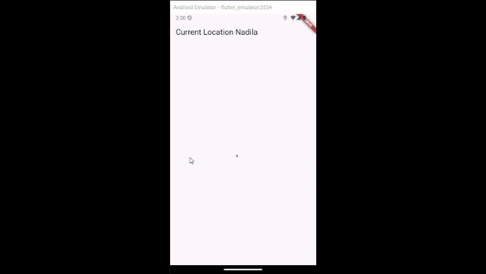
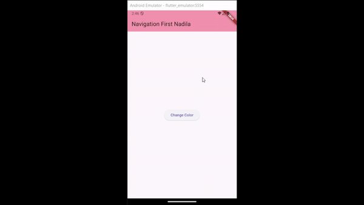

#### Nama : Nadila Amalia Pribadi
#### Kelas: TI-3F / 19
#### NIM  : 2241720114

---

# Laporan Jobsheet 11 Pemrograman Mobile

## Praktikum 1
### Soal 1

### Soal 2

### Soal 3

- Substring pada kode tersebut berfungsi untuk mengambil teks dari index 0 sampai 450. Sedangkan catchError berfungsi untuk menangkap error yang terjadi pada kode tersebut.

## Praktikum 2
### Soal 4

- Pada langkah 1 menginisialisasikan 3 method dengan menggunakan fungsi Future.delayed dengan lama 3 detik dengan return nilai tertentu. Pada langkah ke 2 menginisialiasasikan method count() yang digunakan untuk memanggil ketiga method sebelumnya dan mengganti variable result dengan jumlah nilai kembali dari ketiga method tersebut.

## Praktikum 3
### Soal 5

- Penggunaan Completer dalam Dart untuk mengontrol penyelesaian sebuah Future. Fungsi getNumber menginisialisasi sebuah Completer<int> dan memulai proses perhitungan dengan memanggil fungsi calculate, kemudian mengembalikan properti future dari Completer, yang merupakan Future yang belum selesai. Fungsi calculate melakukan operasi asinkron dengan menunggu selama 5 detik menggunakan Future.delayed, lalu menyelesaikan Completer dengan nilai 42. Ini memungkinkan kode asinkron untuk menunggu hasil dari calculate melalui getNumber.
### Soal 6

- Perbedaan dari kedua kode tersebut adalah Completer akan mengembalikan status Future apakah berhasil atau tidak sedangkan Async Await mengembalikan hasil Future pada fungsi tersebut.

## Praktikum 4
### Soal 7

### Soal 8

- Langkah 1 menggunakan FutureGroup (dari package async), yang menyediakan kontrol eksplisit atas penambahan Future sebelum menutup grup dengan close(). Hasil dari semua Future dalam grup diakses melalui properti future, yang menghasilkan daftar nilai. Langkah 4 menggunakan Future.wait, metode bawaan Dart untuk menjalankan kumpulan Future sekaligus dan menunggu semuanya selesai, mengembalikan hasilnya sebagai daftar. FutureGroup lebih fleksibel jika jumlah Future dinamis, sementara Future.wait lebih sederhana untuk kumpulan Future yang statis.

## Praktikum 5
### Soal 9

### Soal 10

- Hasil tidak berubah. Langkah 1 mendefinisikan fungsi returnError, yang membuat sebuah Future asinkron yang menunggu selama 2 detik sebelum melempar sebuah Exception. Fungsi ini tidak memiliki penanganan error di dalamnya, sehingga akan mengembalikan error langsung kepada pemanggilnya. Langkah 4 adalah implementasi penanganan error melalui fungsi handleError, yang memanggil returnError di dalam blok try-catch. Jika terjadi error, kode di dalam blok catch akan dijalankan untuk menangkap dan menangani error, misalnya dengan mengubah UI menggunakan setState. Selain itu, blok finally memastikan bahwa pesan "Complete" akan dicetak ke konsol, terlepas dari apakah error terjadi atau tidak.

## Praktikum 6
### Soal 11

### Soal 12

## Praktikum 7
### Soal 13

- Pada praktikum sebelumnya menggunakan StatefulWidget sedangkan pada praktikum 7 menggunakan FutureBuilder.
### Soal 14

## Praktikum 8
### Soal 15

### Soal 16

- Saat tombol di tekan maka akan mengarahkan pada NavigationSecond. Pada halaman tersebut dapat mengubah warna background dengan menekan tombol red, green, dan blue yang nantinnya akan merubah variable color pada NavigationFirst.

## Praktikum 9
### Soal 17

- Pada saat tombol di tekan maka akan muncul dialog yang berisi red, green, dan blue yang nantinnya akan merubah variable color pada NavigationFirst.
